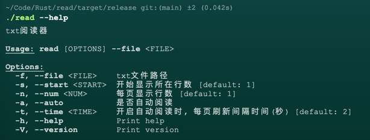

# Read
终端txt文件阅读器(学习Rust项目使用)

# 使用
- 安装rust
- clone 代码
- 执行命令
  ```shell
  cargo run -- --help
  ```
- 生成release包
  ```shell
  cargo build --release
  ```
- 找到可执行文件并执行相关命令
  ```shell
  read --help
  ```
  